# Step 4: Configure the LED

In this step you'll wire the LED to the Raspberry Pi and then add a **board** component in Viam so we can control the GPIO pins from the cloud.

## Wire the LED

With the Pi powered off, wire the circuit on your breadboard:

- **Pi Pin 11 (GPIO 17)** → 220Ω resistor → LED long leg (+) → LED short leg (−) → **Pi Pin 9 (GND)**

**Important:** LEDs are polarized — the longer leg (+) connects toward the resistor, the shorter leg (−) connects to GND.

Power the Pi back on when done.

## Add a Board Component

To control the LED through Viam, we need to add a **board** component. The board component gives Viam access to the Raspberry Pi's GPIO pins.

1. In the Viam app, navigate to your machine's **CONFIGURE** tab.
2. Click **+** (Add Configuration Block).
3. Search for `pi5`.
4. Select **raspberry-pi / pi5**.
5. Name it `board-1`.
6. Click **Create**.

No additional attributes are needed — the default configuration works out of the box.

7. Click **Save**.

## Test the LED from the Viam App

1. On the **CONFIGURE** tab, expand the `board-1` component card.
2. In the **Test** section, find the GPIO pin controls.
3. Enter pin number `11` in the pin field.
4. Click **Set** to set the pin high (3.3V).

Your LED should turn on.

5. Click **Set** again to set the pin low (0V).

Your LED should turn off.

If this works, your wiring is correct and the board component is properly configured. We'll control this pin programmatically in Step 7.

---

**Next step:** [Add a Person Detection Model](../05-Add-a-Person-Detection-Model/)
